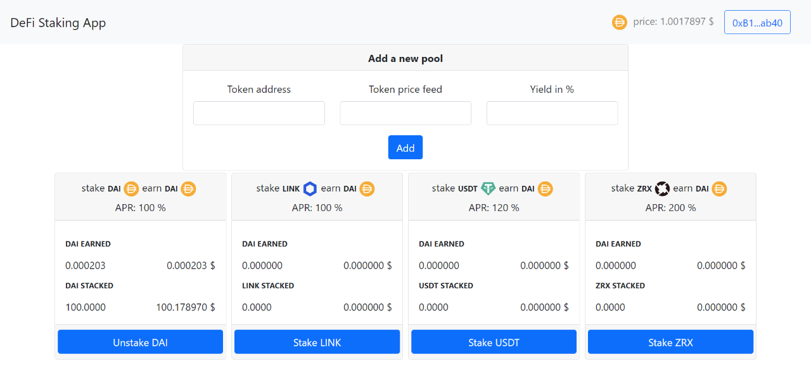

# ⚡️ DeFi - Staking challenge

## Functional specifications :
- Stake its ERC20 token  
- Unstake its tokens  
- Create your own reward token or use ETH or another ERC20 token (Dai for example)  
- The amount of the reward must be proportional to the value locked on the smart contract  

## requirements :
- Using the Chainlink pice feeds oracles  

## result
[https://github.com/steftroubadour/DeFi-Staking](https://github.com/steftroubadour/DeFi-Staking)

## online Demo on GitHub Pages
https://steftroubadour.github.io/DeFi-Staking/

## admin view

## Tests
Tests only pass with Ganache because of the use of Ganache specific functionality on the manipulation of Block's timestamp.

Voir : [https://medium.com/sablier/writing-accurate-time-dependent-truffle-tests-8febc827acb5
](https://medium.com/sablier/writing-accurate-time-dependent-truffle-tests-8febc827acb5)

`truffle test`
